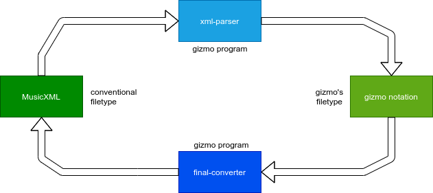

# gizmo
**gizmo** is a simple toolbox to create some simple melodies using python. The beauty about is, that you only need *a single motif* to create a little song. As this toolkit is designed to be used in a terminal, it is very easy to extend and automate.

*Note:* This program uses the [music21](https://github.com/cuthbertLab/music21) library.

## Licensing

Gizmo is a free (as in “free speech” and also as in “free beer”) Software. It is distributed under the GNU General Public License v3 (or any later version) - see the accompanying LICENSE file for more details.

## Installation

Concerning Dependencies: First of all you need [python3](https://www.python.org/downloads/) including the standard librarys. Then install the needed additional modules using pip:

	pip install music21 beautifulsoup4

Now, the easiest way to use gizmo right away without bothering run any installation scripts is to clone this git repository and cd into it:

    git clone https://github.com/noahvogt/gizmo
    cd gizmo

When you are in this basic environment, you can just call all the source files using *src/[file]*. This way, you dont even have to add it to your `path`.

*Note:* It is planned to create a installer to you can call gizmo from your path as this could be better for maintaining a directory structure when just executing the programs provided by this toolkit.

## Usage

### Concept

The concept of our toolkit follows the principles of basic music theory:

- At first you create a motif - the smallest unit in the structure of the composition - on which the final composition is based on.
- Next you create a subject based on the motif and various permutations - and similar sorts of transforming functions - of it.
- Finally you concatenate a song using different variated forms of a subject to form a basic song structure (e.g. the ABBA form).

### Tool Descriptions

This toolkit consists of *three types* of different programs:

- file type converters
- (random) generators for specific parts in the composing process
- short musical converters (e.g. ``half`` halfs the durations off all notes)

Now a description of each single programm/library in ``src/``:

**chordify**: convert a stream of single notes into chords

**clean**: this cleans the working directory of temporary files generated by *thema-gen*. This may be deprecated.

**double**: doubles the duration of all notes

**final-converter**: converts the gizmo notation to MusicXML

**gizmo_funtions.py**: this is a library for basic file operations

**gizmo_transforming_functions.py**: this is a library for musical functions and transformations

**half**: halfs the duration of all notes

**higher-octave**: highes all notes by one octave

**lower-octave**: lowers all notes by one octave

**motiv_gen**: generates a random motif, but accepts optional flags

**song-gen**: composes a little song using basic song structure

**template**: this is a template for a future gizmo tool

**thema-extender**: extends a subject

**thema-gen**: generates a random subject based on input, but accepts different flags

**xml-parser**: converts from MusicXML to the gizmo notation

### The 'gizmo notation'
The usual critique is that programmers always reinvent the wheel unnecessarily. But because we think that most conventional filetypes are too complex for our toolkit, so we made a more unix-friendly alternative that consists simply of *lines in a plain text file*.

Every line contains the information about *one note*. Seperated by commas there are different attributes specified for each note. Every attribute seperated like this is called a **'part'**:

- The first part is a four characters long float that contains the *length* of the note in quarters.
- The second part is two to three chars long. The fist character is the note value (capitalized) and the second one the octave (as an integer). The third char is optional and just the key signature in the form of either "#" or "-".

Here an example in the *gizmo notation*:

	1.00,G4
	1.00,E4
	0.50,D4
	1.00,C#4

Now the same example in *sheet music*:

### Filetype Conversions

The beauty about the simplicity of the gizmo notation is that it can be easily converted from and to established open standards such as MusicXML.

Here a little *visualisation* on how gizmo handles filetype conversions:
 

### Basic Usage Examples

[insert BASIC opertions]

### Rendering
After you fully processed your music in the gizmo notation you can run it through the script called *final-converter* to export your work as a **.musicXML** file. This file can be viewed and further edited/processed in other free software like [MuseScore](https://github.com/musescore/MuseScore).
